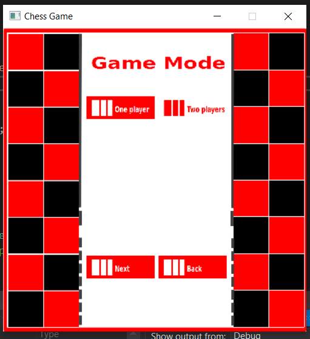
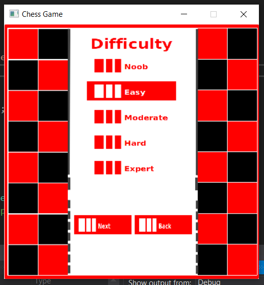
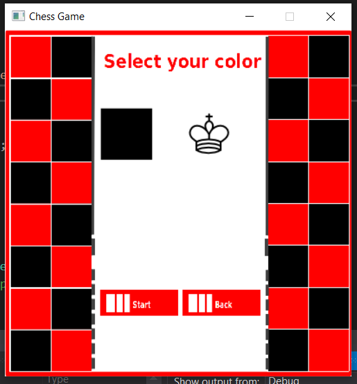
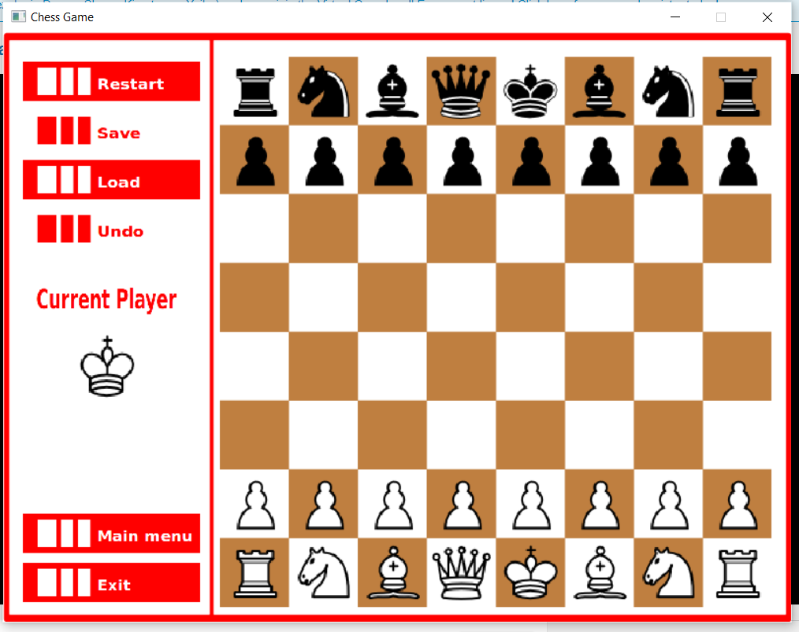
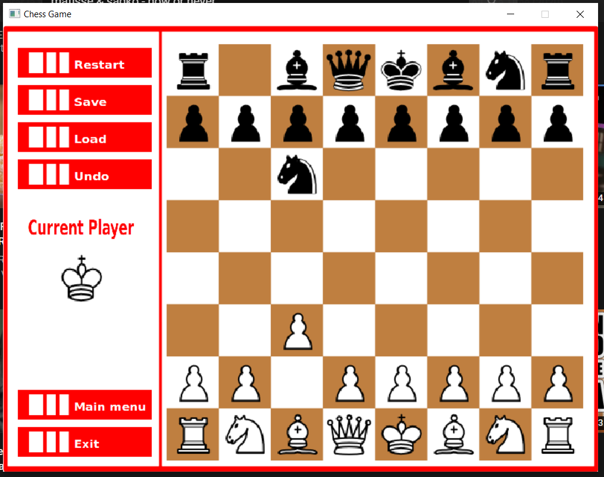
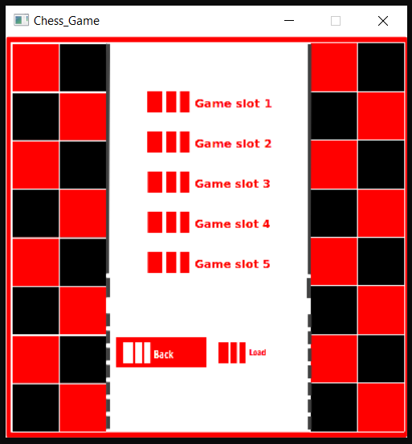

Cheess-Game

The program has two modes:

Console mode (Terminal)

graphical mode (Gui mode) - The graphical mode presents the user with visual
menus and controls enabling the user to play Chess, choose the game’s players (user vs. user
or user vs. computer, and set the game’s difficulty level in case the user is playing against the
computer.

For AI, the Minimax algorithm will be used. The Minimax algorithm is mostly the same as the but I use pruning to improve its efficiency.

Video
https://drive.google.com/file/d/1rkR0snR6qfj0OzUsO6pW5POF3OWCU125/view?usp=sharing

The executable for the program will be named “𝑐ℎ𝑒𝑠𝑠𝑝𝑟𝑜𝑔”. The graphical mode is specified
as a command line argument:

./chessprog -c – will start the program in console mode.

./ chessprog -g – will start the program in GUI mode.

./ chessprog – will execute the program; with the default execution mode - console
